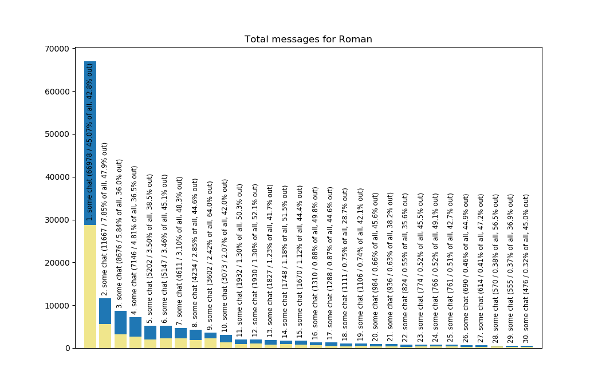

# Telegram messaging stats

## Usage

Execute `python3 tgstats/run.py /path/to/telegram_data/result.json` or execute `python3 tgstats/run.py` and then enter path to the exported JSON file.

Make sure "Account information" and at least some fields under "Chat export settings" are checked while exporting Telegram data.
Contacts list, media, active sessions and miscellaneous data are not necessary.

## Example output

